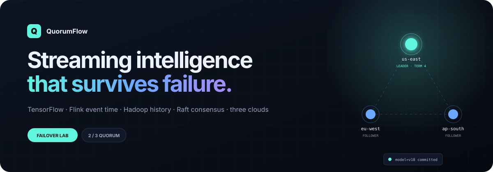
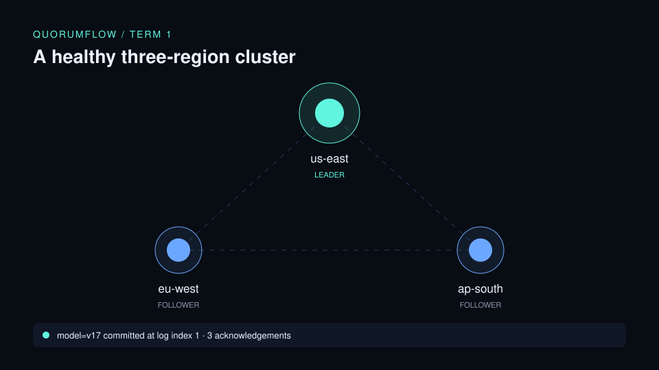
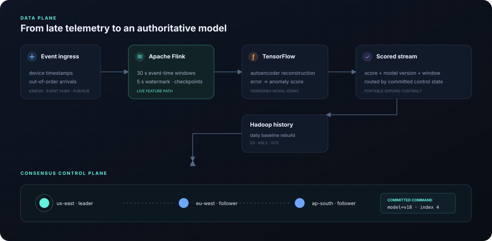
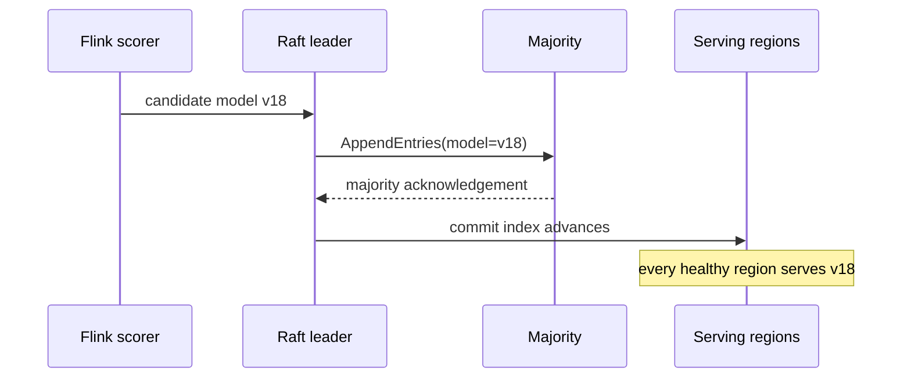

<p align="center">
  
</p>

<p align="center">
  <a href="https://quorumflow-production.up.railway.app/"><strong>Open the live failure lab →</strong></a>
  &nbsp;&nbsp;·&nbsp;&nbsp;
  <a href="#run-it">Run it locally</a>
  &nbsp;&nbsp;·&nbsp;&nbsp;
  <a href="docs/consensus.md">Read the consensus notes</a>
</p>

<p align="center">
  
  
  
  
  
</p>

QuorumFlow is a small but complete design for a problem that shows up in real streaming ML systems: **what happens when the region coordinating a model rollout disappears mid-decision?**

The data plane turns out-of-order device telemetry into anomaly scores. The control plane replicates model-version and routing decisions across three regions. If the leader fails, a new leader can be elected without losing a committed rollout. The live lab makes that failure path visible; the Python model makes it testable.

<p align="center">
  
</p>

## The system in one picture

<p align="center">
  
</p>

1. Telemetry enters with device timestamps, not arrival-order assumptions.
2. Flink assigns a five-second out-of-orderness watermark and emits 30-second event-time feature windows.
3. A TensorFlow autoencoder scores reconstruction error against a threshold learned from normal traffic.
4. Hadoop Streaming recomputes daily baselines from the full event history.
5. The Raft-style control plane commits model versions and route changes only after a majority acknowledges the same log entry.

That last piece matters: without a consensus boundary, two regions can believe different model versions are authoritative after a partition.

## Follow a failure

| Moment | Cluster state | What remains true |
|---|---|---|
| `t0` | `us-east` leads term 1; `model=v17` is committed | All three logs agree at index 1 |
| `t1` | `us-east` is isolated | A stale leader cannot reach a majority |
| `t2` | `ap-south` wins term 2 with two votes | The candidate’s log is at least as current as its voters |
| `t3` | `model=v18` reaches two replicas | The new version is committed exactly once |
| `t4` | `us-east` heals and accepts AppendEntries | The recovered follower catches up before serving decisions |

The browser lab is deliberately deterministic: press **Fail current leader**, **Commit model v18**, and **Heal cluster** to step through those transitions without needing a distributed runtime in the page.

## Code receipts

This repository keeps each claim close to the code that implements it.

| Capability | Concrete implementation | Where |
|---|---|---|
| Consensus | terms, votes, log freshness, majority commit, partitions, healing | [`quorumflow/consensus.py`](quorumflow/consensus.py) |
| Failure verification | elections, no-quorum writes, failover, follower catch-up | [`tests/test_consensus.py`](tests/test_consensus.py) |
| TensorFlow | four-feature Keras autoencoder, normalization metadata, AUC and threshold export | [`ml/train.py`](ml/train.py) |
| Flink | bounded out-of-orderness watermarks, keyed event-time windows, checkpointing | [`streaming/job.py`](streaming/job.py) |
| Hadoop | JSON-lines mapper and streaming reducer for per-device daily baselines | [`batch/`](batch) |
| Multi-cloud | portable resource contract plus AWS, Azure, and GCP Terraform roots | [`infra/`](infra) |
| Runtime | three-member Kubernetes StatefulSet and shared configuration contract | [`k8s/base/`](k8s/base) |
| Live explanation | dependency-free, accessible browser simulation | [`web/`](web) |
| Railway delivery | zero-dependency Node server, health check, restart policy | [`railway.json`](railway.json) |

## Why both streaming and batch?

Flink answers “what is happening now?” under event-time semantics. Hadoop answers “what should the baseline have been?” after late events and the full history are available. The batch output can retrain the TensorFlow model; consensus decides when that new artifact becomes authoritative.



## One contract, three clouds

The application-level behavior stays fixed while managed service names change.

| Workload contract | AWS | Azure | GCP |
|---|---|---|---|
| Event ingress | MSK / Kinesis | Event Hubs | Pub/Sub |
| Flink execution | Managed Service for Apache Flink / EKS | Flink on AKS | Flink on GKE |
| TensorFlow serving | EKS / SageMaker | AKS / Azure ML | GKE / Vertex AI |
| Hadoop backfill | EMR | HDInsight / AKS | Dataproc |
| Versioned artifacts | S3 | ADLS Gen2 | Cloud Storage |
| Portable runtime | EKS | AKS | GKE |

The checked-in Terraform provisions the smallest durable substrate—object storage, registries, and cloud-native coordination resources where useful. It does not silently create expensive managed clusters. See [`infra/README.md`](infra/README.md) for the exact boundary.

## Verified AWS deployment

QuorumFlow's AWS substrate has been **applied to a real AWS account in `us-east-2`** through GitHub Actions using GitHub OIDC and Terraform.

Verified GitHub Actions run: [Deploy AWS substrate #36801440085](https://github.com/mneha05/quorumflow/actions/runs/36801440085)

Terraform's final reconciliation reported:

```text
No changes. Your infrastructure matches the configuration.
Apply complete! Resources: 0 added, 0 changed, 0 destroyed.
```

The deployed resources are:

- versioned S3 artifact lake: `quorumflow-lake-87b9fe73b5255fa8832af9d619`
- DynamoDB control table: `quorumflow-raft-snapshots`
- ECR runtime repository: `quorumflow-runtime`

The workflow authenticates with AWS through a repository-scoped GitHub OIDC role rather than long-lived cloud access keys. It also emits an `aws sts get-caller-identity` receipt plus Terraform outputs as the `quorumflow-aws-deployment-receipt` workflow artifact.

## Run it

**Exercise leader failover**

```bash
python -m quorumflow.simulate
python -m unittest discover -s tests -v
```

The simulation prints the failed leader, elected leader, current term, committed indices, and each replica’s log.

**Rebuild daily baselines locally**

```bash
python batch/mapper.py < samples/telemetry.jsonl \
  | sort \
  | python batch/reducer.py
```

On Hadoop 3.5, set `HADOOP_HOME` and run:

```bash
batch/run_hadoop.sh /quorumflow/telemetry /quorumflow/daily-baselines
```

**Train and score the TensorFlow model**

```bash
python -m venv .venv && source .venv/bin/activate
pip install -r ml/requirements.txt
python ml/train.py --rows 4000 --epochs 8
python ml/score.py --model artifacts/tensorflow < samples/telemetry.jsonl
```

**Run the Flink feature job**

```bash
pip install -r streaming/requirements.txt
python streaming/job.py --input samples/telemetry.jsonl --output artifacts/flink-features
```

## Repository map

```text
quorumflow/   deterministic Raft node and cluster state machine
tests/        election, partition, failover, and catch-up tests
ml/           TensorFlow training and streaming scorer
streaming/    PyFlink event-time feature job
batch/        Hadoop Streaming mapper and reducer
infra/        AWS, Azure, and GCP Terraform roots
k8s/          portable three-member runtime contract
web/          live static failure lab deployed on Railway
server.mjs    zero-dependency Railway production server
docs/         diagrams and consensus design notes
```

## Honest boundaries

- The consensus code is a **synchronous, deterministic Raft model**, not a production network daemon. It models the safety-relevant state transitions; it does not implement randomized election timers, RPC transport, disk WALs, membership changes, or snapshot compaction.
- The live demo visualizes those deterministic transitions in the browser. It is not connected to a hidden cloud cluster and it does not invent throughput or latency numbers.
- The AWS Terraform substrate has been applied and reconciled successfully in `us-east-2` using GitHub OIDC. Azure and GCP Terraform remain declarative examples and have not been applied.
- The TensorFlow smoke workflow trains a small synthetic-data model to prove the path works; it is not a claim about production accuracy.

Those limits are intentional. They keep the interesting guarantees inspectable while leaving clear seams for a real transport, durable storage, and managed cloud execution.

## License

MIT — see [`LICENSE`](LICENSE).
